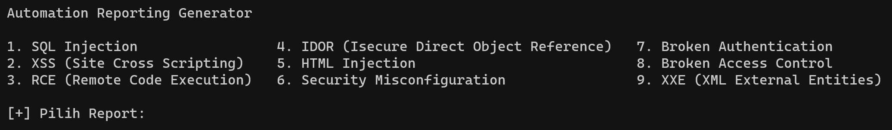

# Reporting Template Generator


Alat ini digunakan untuk menghasilkan template laporan keamanan yang terstruktur untuk berbagai jenis temuan keamanan, seperti XSS, RCE, IDOR, dan lainnya. Alat ini akan membantu Anda dalam menyusun laporan dengan cepat dan konsisten.

## Instalasi

1. Clone repositori ini ke lokal Anda:
   ```

   git clone https://github.com/cehuda/reporting.git
   
   cd reporting

Pastikan Anda memiliki Python yang terinstal. Jika belum, instal Python dari python.org atau melalui manajer paket yang sesuai dengan sistem operasi Anda.


Penggunaan

Jalankan alat melalui perintah berikut di terminal:


    python3 report.py

   Pilih jenis temuan keamanan yang ingin Anda laporkan.

   Ikuti petunjuk yang diberikan untuk mengisi data temuan keamanan, seperti deskripsi, dampak, bukti konsep, dan cuplikan gambar.

   Alat akan menghasilkan laporan keamanan dalam format yang sesuai dengan jenis temuan yang Anda pilih.

   Simpan laporan yang dihasilkan dalam format yang sesuai, seperti PDF atau HTML.

Kontribusi

Kami menyambut kontribusi dari komunitas keamanan. Jika Anda ingin berkontribusi pada proyek ini, silakan buat cabang baru, lakukan perubahan, dan ajukan pull request. Kami akan dengan senang hati meninjau kontribusi Anda.
Lisensi

Proyek ini dilisensikan di bawah MIT License - lihat LICENSE untuk detailnya.
Kontak

Jika Anda memiliki pertanyaan atau masukan, silakan hubungi kami di cehuda2@gmail.com.

Catatan:

Pastikan untuk mengganti informasi seperti nama pengguna GitHub, alamat email, dan kontak sesuai dengan proyek Anda. Selain itu, pastikan alat yang terkandung dalam repository ini benar-benar dapat menghasilkan template laporan sesuai dengan kebutuhan proyek Anda.
